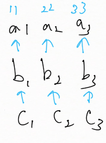
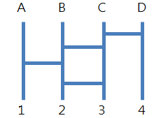
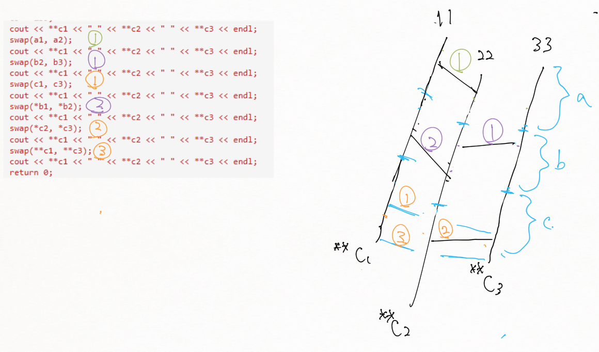

# GhostLeg-Pointer-Vilsualize-cpp
Using the rule of ghost leg to visualize the swapping of of multi-level Pointers 

A pointer is another way to access to the memory location of a variable.

<pre>
int N = 12;
int *pointer;
pointer = &N; //point to N and & means changeble because &N means the address of N.
</pre>

now if we cout pointer it will give us the address of N. Only if we cout *pointer that means the value inside the address of N, which is 12. Therefore if we change pointer we change the address, which has nothing to do with N. But if we change *Pointer what we actually change is the value of N. 

So when:

<pre>
int a, *b, **c, ***d, ****e;
a = 10;
b = &a;
c = &b;
d = &c;
e = &d;
cout << ****e << ***e <<  **e <<  *e <<  e << endl;</pre>

we actually made a pointer e which point to other address four time. We will cout the value of a, then the address of a, b, c, d. 

## Our class has a cool example:

<pre>
#include <iostream>
using namespace std;

int main() {
  int a1, a2, a3;
  a1 = 11;
  a2 = 22;
  a3 = 33;
  int *b1, *b2, *b3;
  b1 = &a1;
  b2 = &a2;
  b3 = &a3;
  int **c1, **c2, **c3;
  c1 = &b1;
  c2 = &b2;
  c3 = &b3;
  cout << **c1 << " " << **c2 << " " << **c3 << endl;
  swap(a1, a2);
  cout << **c1 << " " << **c2 << " " << **c3 << endl;
  swap(b2, b3);
  cout << **c1 << " " << **c2 << " " << **c3 << endl;
  swap(c1, c3);
  cout << **c1 << " " << **c2 << " " << **c3 << endl;
  swap(*b1, *b2);
  cout << **c1 << " " << **c2 << " " << **c3 << endl;
  swap(*c2, *c3);
  cout << **c1 << " " << **c2 << " " << **c3 << endl;
  swap(**c1, **c3);
  cout << **c1 << " " << **c2 << " " << **c3 << endl;
  return 0;
}
</pre>

The result is: 
11 22 33 
22 11 33 
22 33 11 
11 33 22 
11 22 33 
11 33 22 
22 33 11 

We swap some value (the value can be address) each time after cout the **c1 **c2 and **c3 ( the *b's the **c's linked to, to the a's the *b's linked to. )

When we swap b2 and b3 what we actually do is give b2 the address b3 has and give b3 the address b2 has. That is, if b2 was link to a2 (22) and b3 is link to a3 (33), now *b2 is 33 and *b3 is 22. When we swap *c2 and *c3 what we swap is b2 and b3.  

I think of a cool way to visualize it: using the ghost leg:

Now instead of a b c and 1 2 3 we use (the value of a1 a2 a3) at the top and (c1 c2 c3) at the bottom. For each swap we just need to draw a line between the two number. Considering the swap between a1 and a3 we actually need to make a stereoscopic version. After testing and thinking by myself, I found out that the latter changes should be draw below the former ones. For example, if we swap a1 and a2 then swap a2 and a3, now a3 has the value of orig. a1. We draw the line connecting line 3 and line 2 below the line connecting line 2 and line 1 to ensure this happens correctly. 

There are one more thing that we need to consider: what if we swap the a's, the b's and the c's? Which should be placed at the bottom? They should be put in different layers, that is we can deal c to b and b to a seperately. The swaping of c's has nothing to do with the swaping of b's and a's. Since the sequence is c to b to a, the swapping of c should be the lowest, which is near the c at the bottom.

